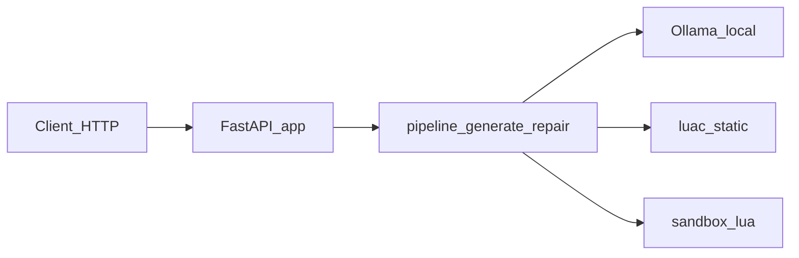

# LocalScript — локальный AI-агент для Lua (хакатон)

Репозиторий — решение для трека **LocalScript**: локальная агентская система на **Python** и **open-source LLM** (Ollama), без внешних LLM API в runtime. Пользователь формулирует задачу на естественном языке, получает Lua-код; сервис поддерживает итерации (`/generate`, `/refine`), валидацию (`luac`, статические правила, sandbox где задано в бенчмарке) и воспроизводимый запуск через **Docker Compose**.

Полный текст условия: [`instruction.txt`](instruction.txt). Контракт API для сдачи: [`localscript-openapi.yaml`](localscript-openapi.yaml).

## Структура репозитория

| Путь | Назначение |
|------|------------|
| [`localscript-agent/`](localscript-agent/) | Основной код: FastAPI (`/generate`, `/refine`, `/health`), клиент Ollama, промпты, извлечение Lua, `luac`, sandbox, пайплайн repair |
| [`localscript-openapi.yaml`](localscript-openapi.yaml) | OpenAPI-контракт |
| [`instruction.txt`](instruction.txt) | Условие хакатона (оригинал) |
| [`Публичная выборка LocalScript.pdf`](Публичная%20выборка%20LocalScript.pdf) | Публичная выборка задач (файл **в репозитории**, обычный `git`, **без Git LFS**; размер ~350 KiB) |

## Однострочный запуск (требование жюри)

Из **корня клона** репозитория:

```bash
cd localscript-agent && docker compose up --build
```

- API: `http://localhost:8080`
- Ollama: `http://localhost:11434`

Подробные шаги установки окружения: [Установка на Linux](docs/INSTALL_LINUX.md), [Установка на Windows / WSL](docs/INSTALL_WINDOWS.md).

## Параметры Ollama (как в условии)

Зафиксированная команда загрузки модели:

```bash
ollama pull qwen2.5-coder:7b
```

| Параметр | Значение |
|----------|----------|
| `num_ctx` | 4096 |
| `num_predict` | 256 |
| batch | 1 |
| parallel | 1 |
| CPU offload весов | не использовать (в compose: `OLLAMA_NUM_GPU=999`) |

Детали и переменные окружения: [`localscript-agent/README.md`](localscript-agent/README.md), эталон: [`localscript-agent/docs/experiments/BEST_CONFIG.md`](localscript-agent/docs/experiments/BEST_CONFIG.md).

### Наблюдаемость и стабильный cold-start

- `GET /health` возвращает не только параметры инференса, но и фактическую готовность: `ollama_reachable` (HTTP `/api/tags`) и `model_ready` (модель из `OLLAMA_MODEL` найдена в списке тегов).
- В `localscript-agent/docker-compose.yml` включён **warmup** на старте API (`OLLAMA_WARMUP_ENABLED=true`), чтобы снизить риск первых таймаутов после поднятия контейнеров. Таймауты настраиваются через `OLLAMA_WARMUP_TIMEOUT_SECONDS` и `OLLAMA_HEALTH_TIMEOUT_SECONDS` (см. [`localscript-agent/README.md`](localscript-agent/README.md)).

## Архитектура (обзор)



Расширенное описание: [`localscript-agent/docs/architecture.md`](localscript-agent/docs/architecture.md).

## Что уже есть / черновики / дорожная карта

**Уже есть**

- Сервис и Docker Compose под GPU.
- Скрипт оценки [`localscript-agent/scripts/eval_public.py`](localscript-agent/scripts/eval_public.py): печатает JSON с `metrics` и `results`. В `metrics`: **M1** `syntax_ok` (`luac`), **M1b** `static_ok`, **M2** `sandbox_ok` (где `eval.type == sandbox`), **M3** `heuristic_ok` (`expected_contains` в [`localscript-agent/benchmarks/public_tasks.json`](localscript-agent/benchmarks/public_tasks.json)), а также `infra_fail`, `generation_error`, `model_error`, `latency_avg`, `latency_p95`. В каждой строке `results[]`: `latency_s` и `errors[]`.
- Журнал прогонов: [`localscript-agent/experiments/runs.csv`](localscript-agent/experiments/runs.csv), выводы: [`localscript-agent/docs/experiments/SUMMARY.md`](localscript-agent/docs/experiments/SUMMARY.md), эталон конфигурации: [`localscript-agent/docs/experiments/BEST_CONFIG.md`](localscript-agent/docs/experiments/BEST_CONFIG.md).
- Quality gate: [`localscript-agent/scripts/quality.sh`](localscript-agent/scripts/quality.sh) (ruff + pytest).

### Как воспроизвести замер метрик (публичная выборка)

Ниже — рекомендуемый путь **внутри docker-compose**, чтобы совпадали версии кода, зависимости и наличие `lua`/`luac` в образе приложения.

```bash
cd localscript-agent
docker compose up -d --build
curl -s http://localhost:8080/health
```

In-process eval (генерация идёт через пайплайн напрямую, Ollama берётся из `OLLAMA_HOST` внутри compose-сети):

```bash
docker compose exec -T app python scripts/eval_public.py
```

HTTP eval (ближе к реальному использованию через FastAPI; внутри контейнера `app` адрес сервиса — `127.0.0.1:8080`):

```bash
docker compose exec -T app python scripts/eval_public.py --http --base-url http://127.0.0.1:8080
```

Сохранить JSON в файл на хосте (пример для bash):

```bash
mkdir -p artifacts
docker compose exec -T app python scripts/eval_public.py --http --base-url http://127.0.0.1:8080 \
  > artifacts/eval_public.http.json
```

Примечания:

- Контракт OpenAPI для `/generate` остаётся минимальным (`prompt` обязателен), но сервис также поддерживает опциональные поля (`context`, `previous_code`, `feedback`) — это отражено в [`localscript-openapi.yaml`](localscript-openapi.yaml).
- Если вы сохраняете JSON через PowerShell `Set-Content -Encoding utf8`, файл может получиться с UTF-8 BOM; при разборе используйте `encoding="utf-8-sig"`.
- Публичный `8/8` — это контроль качества на [`localscript-agent/benchmarks/public_tasks.json`](localscript-agent/benchmarks/public_tasks.json); он **не заменяет** закрытую оценку жюри.

**Нет или вне репозитория**

- Баллы жюри по **закрытой** выборке.
- Формальное подтверждение **пиковой VRAM ≤ 8 GB** на эталонном сценарии жюри — в репозитории чеклисты и смоук: [`localscript-agent/docs/vram_smoke.md`](localscript-agent/docs/vram_smoke.md), [`localscript-agent/docs/hardware.md`](localscript-agent/docs/hardware.md); замеры при сдаче — ответственность команды.

**План улучшений (кратко)**

- Сильнее опираться на **проверку смысла** (sandbox / эталонный вывод), а не только на эвристики строк — см. [`localscript-agent/docs/AGENT_WORKFLOW.md`](localscript-agent/docs/AGENT_WORKFLOW.md); при необходимости расширить `eval` в JSON (например `expected_output`).
- Опционально QLoRA по [`localscript-agent/training/README.md`](localscript-agent/training/README.md) на размеченных эталонах.
- Артефакты сдачи (C4, видео, презентация): статус и чеклист — [`localscript-agent/docs/SUBMISSION.md`](localscript-agent/docs/SUBMISSION.md). В корневом README CI/LICENSE можно добавить позже по согласованию команды.

## Зависимости (сводка)

| Слой | Содержимое |
|------|------------|
| Система | Linux x86_64 или Windows с **WSL2** / Docker Desktop; для GPU — драйвер NVIDIA |
| Docker | Docker Engine + Compose v2 (`docker compose`); образы `ollama/ollama`, сборка приложения из [`localscript-agent/Dockerfile`](localscript-agent/Dockerfile) |
| Python (conda) | Python **3.11**, пакет `lua` (даёт `luac`) — см. [`localscript-agent/environment.yml`](localscript-agent/environment.yml) |
| PyPI | [`localscript-agent/requirements.txt`](localscript-agent/requirements.txt): FastAPI, Uvicorn, httpx, pydantic, pydantic-settings; dev: pytest, ruff |

## Документы и точки входа

- [README подпроекта `localscript-agent`](localscript-agent/README.md) — API, примеры `curl`, eval, conda.
- [Гайд установки (детали Ollama/Docker)](localscript-agent/docs/SETUP_GUIDE.md)
- [Сдача на платформе](localscript-agent/docs/SUBMISSION.md)
